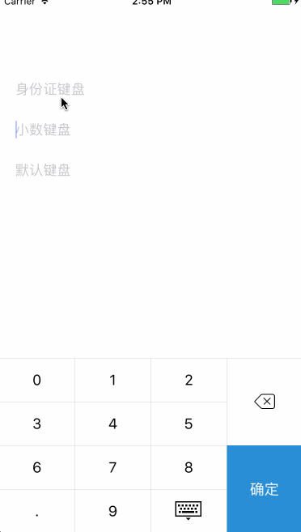

# LYSKeyBord
类似支付宝的键盘

## 效果图

## 键盘类型
typedef NS_ENUM(NSInteger,LYSNumPadStyle){
    DECIMAL,// 可以输入小数点的键盘
    IDCARD,// 身份证键盘
    DEFAULT// 默认键盘
};

## 使用方法
   LYSNumPad *_keyborder = [[LYSNumPad alloc]initWithStyle:IDCARD];
    _keyborder.resignBlock = ^(){
        NSLog(@"resignBlock");
    };
    _keyborder.sureBlock = ^(){
        NSLog(@"sureBlock");
    };
    _keyborder.deleteBlock = ^(){
        NSLog(@"deleteBlock");
    };
    _keyborder.valueChange = ^(NSString *value){
        NSLog(@"value = %@",value);
    };
    UITextField *_txt = [[UITextField alloc]initWithFrame:CGRectMake(20, 100, CGRectGetWidth(self.view.frame) - 40, 40)];
    _txt.inputView = _keyborder;
    _txt.placeholder = @"身份证键盘";
    //_txt.delegate = self;
    [self.view addSubview:_txt];

